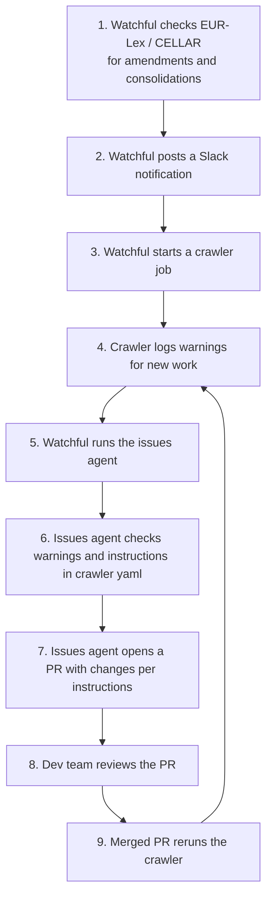

# EU Journal Sanctions: Operational Guide

EU sanctions take legal effect the moment they are published in the EU Official Journal (EUR-Lex), but the consolidated XML feed consumed by the `eu_fsf` and `eu_sanctions_maps` crawlers has historically lagged by days or even weeks. The `eu_journal_sanctions` dataset bridges that gap. See the [blog post](https://www.opensanctions.org/articles/2024-11-11-eu-sanctions/) for the public-facing explanation.

## Watchful monitoring and agentic extraction

Watchful has an EU Journal task monitoring CELLAR for new sanctions frameworks, amendments, and consolidation updates.

It kicks off crawler jobs which result in warnings for the issues agent to work on and for us to review.

### Operations



The crawler itself detects new amendments and drift from the consolidated text, and reports them as warnings. Expect these on the issues dashboard for `eu_journal_sanctions`:

| Warning | Meaning | Action |
|---------|---------|--------|
| `Amending act has no reviewed transcription` | A new amendment is on EUR-Lex but has no transcribed data yet | Wait for the issues-agent PR, then review it (see below). |
| `Newer consolidated version published` | CELLAR published a consolidation newer than the one we pin | Expect an issues-agent PR re-pinning and re-parsing. Review it. |

#### PR review policy

Generally, familiarise yourself with the instructions to the Maintainer in the dataset yaml - usually issues-agent (an LLM), to figure out what the intended changes are for a given warning. Additional review instructions are listed for the Reviewer in the dataset yaml.

Furthermore

- Check that every entity in the amendment is present, and that names, IDs, dates and program match the source.
- If identifiers such as passport numbers appear in aliases **and** in the correct columns, accept. The alias noise gets cleaned in name-cleaning data reviews.
  - Look out for data reviews following a PR merge.
- If identifiers are **not** in the correct columns, reject. Comment on the PR with @claude for it to fix.


## eu_journal EUR-LEX SOAP and manual extraction

The original workflow: an operator extracts entity tables from EUR-Lex amendment pages and pastes them into a Google Sheet, which the `eu_journal_sanctions` crawler reads every two hours.

The Google Sheet is at:
<https://docs.google.com/spreadsheets/d/1rauQMdCYTjTwmSzqfUvur1SfkCGYwfRn6_e5_oX39EY/edit?gid=0>

### Monitoring for amendments

A cron job watches for new amendments to the legislation listed at <https://www.sanctionsmap.eu/#/main> and posts a Slack message when one is found, e.g.:

> New document on EUR-Lex regarding 'Restrictive measures in view of Russia's actions…':
> Commission Implementing Regulation (EU) 2026/124 of 14 January 2026 amending Council Regulation (EU) No 833/2014…
> https://eur-lex.europa.eu/legal-content/EN/TXT/?uri=CELEX%3A32026R0124

Previously seen amendments are stored at <https://github.com/opensanctions/eu_journal>.

### Claiming work

Add the 👀 emoji to the Slack message to signal that you are handling it. This prevents duplicate effort when multiple operators are watching the channel.

### Evaluating an amendment

Most amendment packages consist of a **Council Decision** and an **Implementing Regulation** published on the same day. Process the pair only once — prefer the Regulation over the Decision.

For each Slack message, decide:

| Situation | Action |
|-----------|--------|
| Amendment adds or modifies entities | Extract tables and add to the Google Sheet (see below) |
| Amendment removes entities | Delete matching rows (same entities, same sanctions program) from both the Unconsolidated and Context sheets |
| Amendment is procedural, a correction, or otherwise has no entity changes | Add 🚫 to the Slack thread |
| Already handled as the paired document | Add 🚫 to the Slack thread |

When all items in an amendment are fully handled, copy the new rows to the Context worksheet, and add ✅ to the Slack thread.

### Extracting tables from EUR-Lex HTML

EUR-Lex uses Cloudfront WAF that blocks direct HTTP fetches. Save the amendment page manually:

1. Open the EUR-Lex URL from the Slack message in a browser.
2. Save as **HTML Only** (not "Web Page, Complete").
3. Run the extraction script from the project root:

```bash
python datasets/eu/journal_sanctions/extract_tables.py --path /path/to/saved.htm
```

The script outputs one CSV per entity table: `{doc_reference}_table_{i}.csv`. It prints a summary of tables extracted and skipped (layout-only tables are skipped automatically).

4. Open each CSV in a spreadsheet editor and inspect the columns before copying.

> **Note:** The script also supports `--url` for direct fetching, but this fails when Cloudfront blocks the request.

### Adding data to the Google Sheet

Target worksheet: **Unconsolidated** (the first tab, `gid=0`).

Copy the rows from the CSV into the sheet, matching the column layout. Key rules:

- **Multiple values** in a single cell are semicolon-separated (e.g. `John Smith; Ivan Petrov`).
- **Leave the `schema` column until last.** The crawler cannot emit an entity without a schema, so the crawler fails with an error preventing exporting partially-edited data.
- **Be careful with fill-down on source URLs.** Google Sheets auto-increments the last number in a URL when you drag-fill a cell. Hold **Ctrl** (Windows/Linux) or **Option** (Mac) while filling down to copy the value literally without incrementing.
- **Check every row.** Pasting a value into the wrong column emits incorrect entity data. Double-check the column headers before and after pasting.

### Verification

The `eu_journal_sanctions` crawler runs on a `0 */2 * * *` schedule (every two hours). After the next run, check `data/datasets/eu_journal_sanctions/issues.log` for any parsing errors or unexpected warnings related to your new rows.
