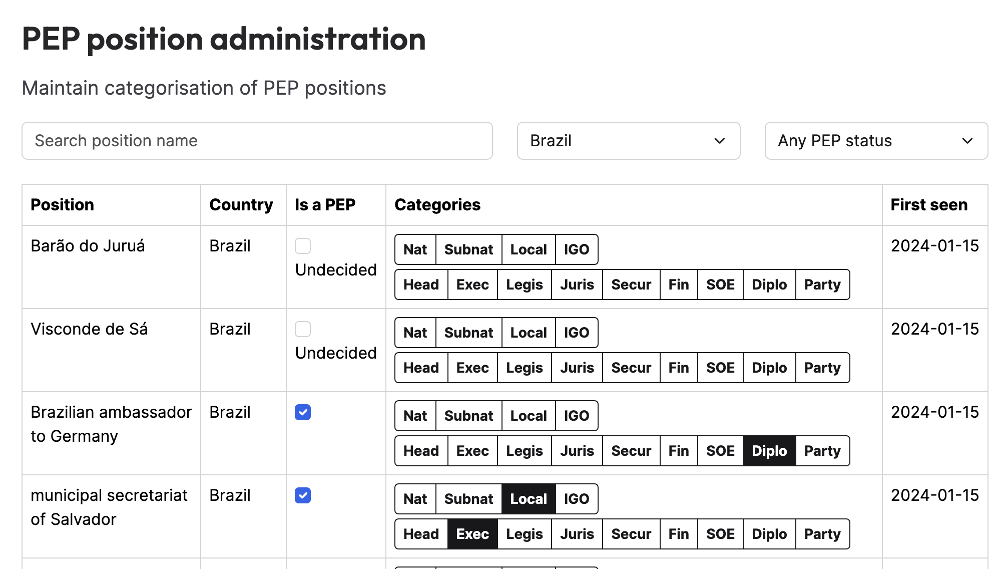

# Developing crawlers for Politically Exposed Persons (PEPs)

If this is your first crawler, start with a basic one by following the
[tutorial](tutorial.md), then come back here. For common approaches, look at the
children of the [peps collection](https://github.com/opensanctions/opensanctions/blob/main/datasets/_collections/peps.yml).

Being classified as a PEP does not imply you have done anything wrong. The
concept matters because PEPs and members of their families should be the subject
of enhanced public scrutiny, which is also mandated by financial crime laws in
many countries. Read more about the [PEP data](https://www.opensanctions.org/pep/).

## How a PEP is modeled

A PEP is represented as three linked entities:

- a **Person** — the individual.
- a **Position** — the political role that confers exposure (e.g. *Member of the
  Bundestag*), defined independently of who holds it.
- an **Occupancy** — the time-bounded link recording that a person held a
  position over some period.

So one person who has held two roles produces one Person, two Positions, and two
Occupancies.

[`make_occupancy`][zavod.helpers.make_occupancy] is the linchpin: it builds the
Occupancy, sets its `status`, adds the `role.pep` topic to the person, and
returns nothing once political exposure has lapsed. A person should be emitted as
a PEP only when at least one occupancy qualifies. Let `make_occupancy` add
`role.pep`; set it by hand only as a rare exception, when the data is too sparse
to model an occupancy or to capture someone with clear political influence but no
formal position.

For relatives and close associates, add the `role.rca` topic and the most
appropriate relationship entity. See [Relatives and close associates](#relatives-and-close-associates).

## Properties to capture

Every property in the schema is welcome: capture whatever the source gives you
cleanly. The authoritative list for each is `ftm ref schema Person` / `Position`
/ `Occupancy`. The notes below cover only what is required or specifically
valuable for political exposure; for general attributes and how to prioritize
effort, see [data collection priorities](best_practices/priorities.md).

**On the person:** use the most precise country property the source supports,
without overstating. Use `citizenship` for elected officials, who in most countries
must be citizens to hold office (the United Kingdom being a notable exception). Use
`country` for civil servants, state-owned-enterprise managers, and appointed
officials, who face no such requirement.

**On the position:** `country` is required; occasionally several apply (e.g.
*Ambassador of Palestine to Germany*). `subnationalArea` locates a sub-national
role. See [Creating positions](#creating-positions) and [Categorizing positions](#categorizing-positions).

**On the occupancy:** dating it determines whether exposure still applies; see
[Creating occupancies](#creating-occupancies) and
[Historical and multi-term sources](#historical-and-multi-term-sources).
Valuable where available: `constituency`; `electionDate`; and `politicalGroup`,
the parliamentary faction held within the body, distinct from general party
membership in `Person:political`.

**Do not extract**, even when cleanly available: private individual addresses (a
privacy concern) and phone numbers (more sensitive than emails). These are
prohibitions, not low priorities.

## Creating positions

The [Position](https://www.opensanctions.org/reference/#schema.Position) `name` property should ideally capture the position and its jurisdiction, but be no more specific than that.

!!! info "Supplying Wikidata QIDs"
    Most political positions in the world already exist in Wikidata. If your crawler emits only
    a small number of positions, it is best practice to look up the Wikidata QIDs for these
    and supply them to the `h.make_position` helper so that reconciliation is automatic.

### Selecting a position name

Do

- write the position in English when the crawler supplies the name itself. Use
  the standard English term for the role (e.g. `Mayor`, not `Bourgmestre`).
  Preserve native-language terminology only for proper nouns of specific
  institutions where translation would obscure the reference
  (e.g. `Landtag of Mecklenburg-Vorpommern`, not `State Parliament of …`).
- always pass `lang=` to `h.make_position` declaring the language of the name you
  pass. When the position name comes from the source in a non-English language,
  pass it unmodified with `translate_name=True` — the helper translates it to
  English and derives the entity ID from the untranslated name, keeping IDs
  stable. When the source has only very few distinct labels, a `position` lookup
  in the YAML translating them to English is an acceptable alternative.
- include the role
- include the organizational body where needed
- include the specific geographic jurisdiction where relevant
- refer to [Wikidata EveryPolitician](https://www.wikidata.org/wiki/Wikidata:WikiProject_every_politician)
  for examples, specifically [position Q4164871](https://www.wikidata.org/wiki/Q4164871).
  Much careful work has been done there on defining positions in understandable
  and accurate ways.

Avoid

- including the legislative term
- including the constituency an elected official represents
- including the country for sub-national representatives

### Examples

- Prefer `United States representative` over `Member of the House of Representatives` -
  while it's true that they're a member of the house of representatives, the
  common generic term is United States representative.
- Prefer `Member of the Landtag of Mecklenburg-Vorpommern` over `Member of the Landtag of Mecklenburg-Vorpommern, Germany` -
  the country is already captured
  as a property of the entity.
- Prefer `Member of the Hellenic Parliament` over `Member of the 17th Hellenic
  Parliament (2015-2019)` - there is currently no need to distinguish between
  different terms of the same position. Occupancies represent distinct periods
  when a given person holds a position. If the same position occurs twice in time,
  e.g. it was only possible to be `Minister of Electricity` up until 2015 and
  again from 2023, those can be distinguished sufficiently using the dissolution
  and inception properties rather than the name.

Use the [`make_position`][zavod.helpers.make_position] helper to generate position entities consistently.

!!! info "Pro tip"
    It's perfectly fine to emit the same position over and over for each instance
    of a person holding that position, if that simplifies your code.

    It is often convenient to create the person, all their positions, and
    occupancies in a loop. You don't have to track created positions in your
    crawler to avoid duplicates, as long as the position `id` is consistent for
    each distinct position encountered. This is the case if the values you pass
    [`make_position`][zavod.helpers.make_position] are consistent. The export
    process takes care of deduplication of entities with consistent `id`s.

## Categorizing positions

Most sources by their nature comprise entirely of PEPs. On rare occasions a
source can contain positions that fall outside the [categories of roles considered PEPs](https://www.opensanctions.org/docs/pep/methodology/#types).

OpenSanctions maintains a database that categorizes positions as PEP or not,
along with their [scope and role](https://www.opensanctions.org/docs/topics/#politically-exposed-persons).
This categorization determines whether a position, its holders, and the Occupancy
entities relating them should be emitted, based on whether it is a PEP position
and the PEP duration of its scope.



To allow newly discovered positions to be added to the database, and to use the
`is_pep` value from the database, call `zavod.stateful.positions:categorise` with the Position.
If the data source is known to only include PEP positions, or if the crawler only
attempts to create positions known to be PEPs, the `default_is_pep` argument should be `True`.
Otherwise it should be `None`, denoting that it should be categorized manually
in the database.
**Only make occupancies and emit entities for which the returned `categorisation.is_pep` is `True`**.
See example below.

With `default_is_pep=None`, a not-yet-reviewed position returns `is_pep=None` and
its holders are not emitted. A new crawler against an uncategorized source then
produces no PEP output until someone sets `is_pep` in the review UI, and only the
next crawl picks those people up. Use `None` only when the source genuinely mixes
PEP and non-PEP roles; when the source is known to consist entirely of PEPs,
`True` is correct.

Positions are created in the database if they don't already exist, and can be
categorized manually later. The `is_pep` and `topics` values from the database
are then used during crawling and [enrichment](https://www.opensanctions.org/datasets/annotations/)
respectively.

### ::: zavod.stateful.positions.categorise

### ::: zavod.stateful.positions.PositionCategorisation


## Creating occupancies

Occupancies represent the fact that a person holds or held a position for a given
period of time. If a person holds the same position numerous times, emit an
occupancy for each instance.

For most positions, someone holding a position becomes less and less significant over time.
It becomes less important to carry out anti money-laundering checks on people the
more time has passed since they held a position of influence which could enable
money laundering. A person is therefore represented as a PEP only if a data source
indicates they hold the position now, or they left the position within the past 5
years. In these cases the occupancy status should be `current` or `ended` respectively.

If the data or the source's methodology makes it unclear whether a position is
currently held, someone is considered a PEP if they have not died and entered the
position within the past 40 years. In this case the occupancy status should be
`unknown`.

When the source records that a person has died or left office mid-term, set their
`deathDate` (on the person) and the occupancy `endDate`, rather than skipping them.
`make_occupancy` applies the thresholds above and returns `None` once the person no
longer qualifies, so a recently deceased or recently removed office holder is still
emitted with an `ended` occupancy, while one who left long ago is dropped automatically.

Date each occupancy. Use `startDate`/`endDate` for a person's own mandate (a member who
left mid-term, or any source giving per-person dates); use `periodStart`/`periodEnd` for
whole-term membership, where you only know the term's bounds and they are identical for
everyone who served that term. The two can coexist, and `make_occupancy` treats an
individual end date as the more specific signal. If neither is known, `electionDate` can
stand in as a fallback for inferring exposure.

Pass `no_end_implies_current=False` for sources that don't reliably remove people when
they leave office (static snapshots, scraped archives), so an occupancy with no end date
resolves to `unknown` rather than `current`. Leave the default (`True`) only when the
source is actively maintained and can be trusted to drop departed office-holders.

Let `make_occupancy` derive the `status` from these dates; do not pass `status="ended"`
yourself when you have an end date. Override `status` only when the source states that a
mandate is current or ended but gives no date to derive it from.

### Only emit if the person is a PEP

Occupancies and positions should only be emitted for instances where these
conditions are met. Persons should only be emitted if at least one occupancy
exists to indicate they meet the criteria for being considered a PEP.

The [`make_occupancy`][zavod.helpers.make_occupancy] helper returns occupancies
only if they still meet these conditions, taking the [PEP duration](https://www.opensanctions.org/docs/pep/methodology/#types)
into account. Use it to create occupancies, set the correct `status`
automatically, and determine whether the occupancy meets the criteria and should
be emitted.

### Example

```python
# ... looping over people in a province ...
person = context.make("Person")
source_id = person_data.pop("id")
person.add("name", person_data.pop("name"))
person.add("citizenship", "us")
# Set deathDate rather than skipping the person; make_occupancy decides PEP status.
h.apply_date(person, "deathDate", person_data.pop("death_date", None))
# ... more person properties ...

for role in person_data.pop("roles"):
    position = h.make_position(
        context,
        f"Member of the {province} Legislature",
        wikidata_id="Q....",
        country="us",
        subnational_area=province
    )
    categorisation = categorise(context, position, default_is_pep=True)
    if not categorisation.is_pep:
        continue
    occupancy = h.make_occupancy(
        context,
        person,
        position,
        start_date=role.get("start_date", None),
        end_date=role.get("end_date", None),
        categorisation=categorisation,
    )
    if occupancy is not None:
        context.emit(occupancy)
        # Emitting the position and person multiple times is a bit wasteful
        # but not harmful:
        context.emit(position)
        context.emit(person)
```

## Historical and multi-term sources

Current office holders are the priority, but when a source also exposes past terms
cheaply (the same table, or a per-term archive), it is worth crawling them. A national
legislator remains politically exposed for years after leaving office, so several terms
still matter.

Two mechanisms divide the labor:

- [`earliest_term_start`][zavod.helpers.earliest_term_start] bounds how far back you
  **crawl**: skip fetching whole terms or archive pages older than the PEP-relevance
  window. The only thing it buys you is the crawl you avoid, so there is no point
  applying it to terms you would fetch anyway; [`make_occupancy`][zavod.helpers.make_occupancy]
  gates those records more precisely. Log a skipped term at `info`; it is a deliberate
  gap, not something the crawler team can fix.
- [`make_occupancy`][zavod.helpers.make_occupancy] is the decider on whether political
  exposure still applies, per occupancy. The cutoff is deliberately more generous than
  this window, so it never skips a term whose members would still qualify.

Date each occupancy as described in [Creating occupancies](#creating-occupancies). Whole-term
archives are the typical case for `periodStart`/`periodEnd` (the same term bounds applied to
everyone who served), while a source giving per-person dates uses `startDate`/`endDate`.

## Relatives and close associates

Relatives and close associates (RCAs) are rare in PEP sources but valuable under AML
regimes: the family members and close associates of a politically exposed person
warrant the same enhanced scrutiny. When a source links a PEP to such a person, model
the relationship:

- Emit the relative or associate as a **Person** carrying the `role.rca` topic, not
  `role.pep`: their exposure comes from the relationship, not from holding office.
  They get **no Position or Occupancy**.
- Link them to the PEP with the relationship entity that fits the source:
    - **Family** for kinship: set `person` to the PEP and `relative` to the family member.
    - **Associate** for a known non-family relationship, such as a business partner or
      close friend: set `person` to the PEP and `associate` to the other party.
    - **UnknownLink** only when the source asserts a connection whose nature is unclear:
      set `subject` and `object`.
